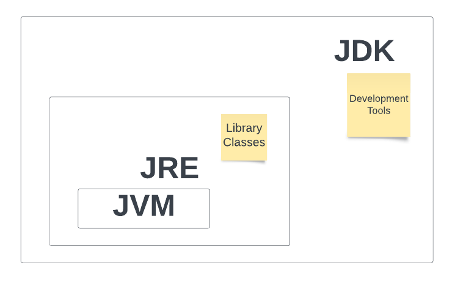
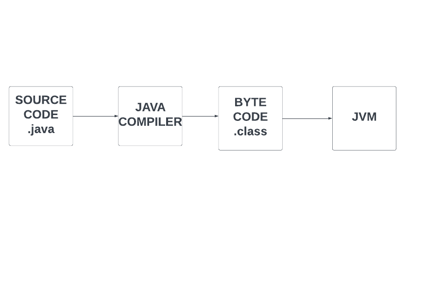

## JDK, JRE, JVM

- Java Development Kit (JDK)  is a software development kit used to develop Java applications.
    
        JDK = JRE + Development tools
- Java Runtime Environment (JRE) is a software package that provides Java Virtual Machine (JVM), class libraries and other components to run applications in Java.
        
        JRE = JVM + Class libraries 

- Java Virtual Machine (JVM) is an abstract machine that provides an environment for the execution of Java ByteCodes.
            
        JVM = provides a runtime environment.

## How Java Program Runs?

## javac command
- The javac command in Java compiles a program 
        
        javac filename

- The java command is used to execute Java bytecodes. It takes bytecode as input, executes it, and outputs the result.

        java filenname

